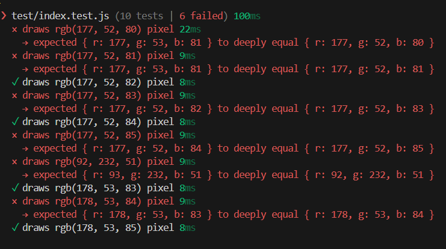

# sharp-usage-example

> [Sharp](https://github.com/lovell/sharp) usage demo.

## What is a task?

Draw a color at specified pixel.

## What is a solution?

A solution is to use `.composite` api provided by sharp. A code would be as the following:

```javascript
const imageFile = 'images/sample.jpg';
const destFilename = 'images/sample_processed.jpg',
const color = { r: 177, g: 52, b: 85 };
const colorBuffer = await sharp({
    create: {
      width: 1,
      height: 1,
      channels: 3,
      background: color,
    },
  })
    .png()
    .toBuffer();
const compositeList = [{
    input: colorBuffer,
    left: 0,
    top: 0,
    blend: "atop",
  }];

await sharp(imageFile).composite(compositeList).toFile(destFilename);
```

## What is an issue?

Sometimes a color that is about to be drawn at specified pixel does not have exact color as specified in provided input.

For example there are some scripts you can run

| Script    | Specified color | Actual color |
| --- | --- | --- |
| usage.js  | { r: 177, g: 52, b: 82 }  | { r: 177, g: 52, b: 82 } |
| usage2.js | { r: 177, g: 52, b: 85 }  | { r: 177, g: 52, b: 84 } |

## What test results look like?

There are test suites in tests/index.test.js so you can run them by issuing `npm test` or `pnpm test`.

Screenshot of tests showing failed and passed tests looks like the following:



As can be seen from tests results some colors were drawn in exactly specified color but others have micro discrepancy.

## How to setup a repo?

```bash
$ git clone https://github.com/akgondber/sharp-usage-example.git
$ pnpm install
$ pnpm test
```

## How to run demo examples?

There are prepared scripts in package.json file that are ready to use. A source image is `images/sample.jpg` having 1x1 size.
- `usage` - replaces color in `images/sample.jpg` and stores new file in `images/sample_processed.jpg`
- `usage2` - replaces color in `images/sample.jpg` and stores new file in  `images/sample_processed_2.jpg`
- `showfirstpixel` - displays first pixel color of `images/sample_processed.jpg` image
- `showfirstpixel2` - displays first pixel color of `images/sample_processed_2.jpg` image
___


```bash
$ pnpm usage
$ pnpm showfirstpixel
$ pnpm usage2
$ pnpm showfirstpixel2
```
